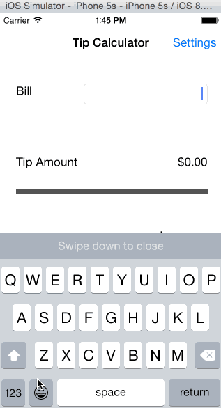

This is an iOS demo application for calculating tips. Tip Calculator walkthrough is at http://vimeo.com/74764846

Time spent: 5 hours spent in total

Completed user stories:

Required: User can calculate tips given the bill amount and tip percentage
Required: User can set the default tip percentage
Optional: Bill amount is saved across app restarts and cleared out after 10 minutes
Optional: Tip/Total amount is formatted with user locale

